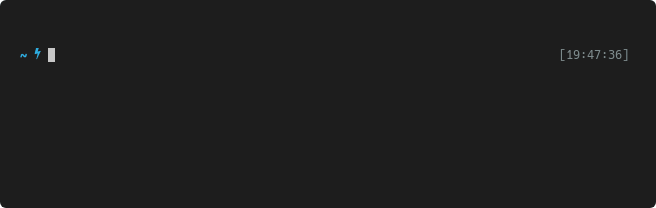
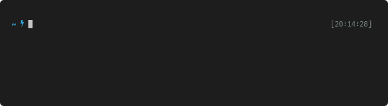
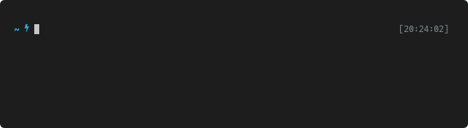

# My Command Line Setup
{: .no_toc }

<details open markdown="block">
  <summary>
    Table of contents
  </summary>
  {: .text-delta }
1. TOC
{:toc}
</details>

- - -

## The terminal: Yakuake

A terminal emulator is the program that provides access to the command line, and
I've stuck with [**Yakuake**](https://apps.kde.org/yakuake/), a KDE-based drop-down
terminal, for many many years now.  I like the drop-down style of quickly
rolling the terminal down and up again, but the most important feature for me is
this:

I've made the `<F1>` key into a global shortcut for opening & closing my terminal.
{: .callout .callout-primary}

You can use other keys for that purpose, but I've never found that `<F1>`
conflicted with any function that I cared about in another program—typically it
is reserved for showing "help" screens.  You can also set this up with any other
terminal emulator, though Yakuake offers this functionality right out of the box.
The important thing here is that **I can open and close my terminal with the
press of a single key, no matter what I'm currently doing on my system.**  I've
found that super convenient.

- - -

### Emoji support

Does your terminal correctly render Unicode emoji?

```bash
echo "Emoji time!" 👍 🍎 🐜 🐻 🥖 🚌
```

In principle, if you're working in a graphical desktop environment, there's no
reason why it shouldn't, but you might have to tweak your system's font
configuration. Make sure you have [Noto Emoji
fonts](https://github.com/googlefonts/noto-emoji) installed (of course you can
also choose any other emoji font, like [JoyPixels](https://www.joypixels.com/)),
then create a file named `~/.config/fontconfig/conf.d/99-color-emoji.conf` with
the following contents:

```xml
<?xml version="1.0" encoding="UTF-8"?>
<!DOCTYPE fontconfig SYSTEM "fonts.dtd">
<fontconfig>
  <alias>
    <family>monospace</family>
    <prefer>
      <family>Noto Color Emoji</family>
    </prefer>
  </alias>
</fontconfig>
```

Then, run `fc-cache -f` to rebuild your font cache. Finally, restart your
terminal application.

If that didn't do the trick, you could refer to [Victor Kropp's
blogpost](https://victor.kropp.name/blog/emoji-on-linux/) or [this GitHub
gist](https://gist.github.com/IgnoredAmbience/7c99b6cf9a8b73c9312a71d1209d9bbb)
for slight variations on the same idea.

- - -

### Multiplexer and workspaces

For me, using a terminal multiplexer is mainly useful for **preserving remote
shell sessions**, i.e., keeping sessions and programs within it running when
logged in via SSH, but it can also be a great tool for better organizing your
terminal workspace.

The classic option here is
[**tmux**](https://www.howtogeek.com/671422/how-to-use-tmux-on-linux-and-why-its-better-than-screen/). A
more modern alternative that's supposed to give a nicer user experience is
[**byobu**](https://www.byobu.org/). Currently, I'm trying out
[**zellij**](https://zellij.dev/), which primarily calls itself a "terminal
workspace" but has some tmux-like functionalities (like detaching a session).

### The shell: fish

The default shell on most Linux systems is the [Bash
shell](https://en.wikipedia.org/wiki/Bash_(Unix_shell)), and you can't go wrong
with learning how to use it. However, I made the switch to
[**fish**](https://fishshell.com/) a couple of years ago and now I never want to
use anything else.

What's nice about the [fish shell](https://fishshell.com/) is that it offers autosuggestions, tab completions, syntax highlighting, and is easy to customize and write scripts for.
{: .callout .callout-primary }

Fish can suggest completions for executables, paths, options, and even full
command invocations from your history.  Press tab to easily accept these
completions.  Syntax highlighting will furthermore tell you if a command exists
& is executable, if a given file path is valid, or if you forgot the closing
quotes on a string, _all before you ever press "Enter"._


{: .text-center}

There's one potential downside, which is that fish is not POSIX-compatible,
meaning that if you're used to Bash syntax, you might have to relearn a few
things.  In practice, I've never found this to be a huge issue.  Some common
differences that I quickly got used to are:

1. Slightly different keywords for loops and conditions:
   - <span class="d-inline-block" style="min-width:2.8em;">fish:</span><code class="highlight language-fish" data-lang="fish"><span class="k">for</span> f <span class="k">in</span> <span class="k">*</span>.pdf<span class="p">;</span> pdfinfo <span class="nv">$f</span><span class="p">;</span> <span class="k">end</span></code>
   - <span class="d-inline-block" style="min-width:2.8em;">bash:</span><code class="highlight language-bash" data-lang="bash"><span class="k">for </span>f <span class="k">in</span> <span class="k">*</span>.pdf<span class="p">;</span> <span class="k">do </span>pdfinfo <span class="nv">$f</span><span class="p">;</span> <span class="k">done</span></code>
2. Command substitutions without a dollar sign:
   - <span class="d-inline-block" style="min-width:2.8em;">fish:</span><code class="highlight language-fish" data-lang="fish"><span class="nb">echo</span> <span class="si">(</span>somecommand<span class="si">)</span></code>
   - <span class="d-inline-block" style="min-width:2.8em;">bash:</span><code class="highlight language-bash" data-lang="bash"><span class="nb">echo</span> <span class="si">$(</span>somecommand<span class="si">)</span></code>
3. Declaring variables:
   - <span class="d-inline-block" style="min-width:2.8em;">fish:</span><code class="highlight language-fish" data-lang="fish"><span class="k">set</span> <span class="nv">foo</span> <span class="s2">"bar"</span></code>
   - <span class="d-inline-block" style="min-width:2.8em;">bash:</span><code class="highlight language-bash" data-lang="bash"><span class="nv">foo</span><span class="o">=</span><span class="s2">"bar"</span></code>

The fish documentation has [a comprehensive overview of the differences to Bash
syntax](https://fishshell.com/docs/current/fish_for_bash_users.html), but also,
remember that even if you set fish as your default shell, Bash is still there
for you—you can still write & run Bash scripts if that's what you're more
comfortable with for a given task.  The syntactic differences are mostly
relevant for writing quick one-liners directly on the command line.

- - -

### fzf (search extension)

[**fzf** ("fuzzy finder")](https://github.com/junegunn/fzf) is a command-line
tool for finding things, but also works as an [awesome fish
extension](https://github.com/jethrokuan/fzf).  It also [comes with built-in
support for bash and
zsh](https://github.com/junegunn/fzf#fuzzy-completion-for-bash-and-zsh), though
I haven't tried that.

Want to `cd` into some deeply nested directory like
`~/Documents/Courses/Intro_to_programming_2021/assignments/week3/`?  That's a
lot of keys to press, even with the help of tab completions.  How about just
typing `<Alt-C> week3 <Enter>`?


{: .text-center}

What was that long one-liner you used a few months ago, of which you remember
nothing except that one of its arguments was a file named `plot.pdf`?  How about
just typing `<Ctrl-R> plot.pdf` and seeing what comes up?  Of course, you could
also `grep` through your history file, but with fzf's `<Ctrl-R>` you get fuzzy,
interactive search, and if you find the command you were looking for, pressing
`<Enter>` on it will paste it directly onto your command line.

- - -

### Starship (prompt)

I used to add a lot of customizations to my shell prompt, but
[**Starship**](https://starship.rs/) has made the process a whole lot quicker
and more enjoyable. It also works on top of _any shell._ By default, it will
give you a two-line prompt that includes information about Git branches and
states, as well as version information of any programming languages relevant for
your current directory.

You can [configure its appearance in detail](https://starship.rs/config/)
(including a more compact one-line format, if that's what you prefer), which I
have of course [done quite extensively
myself](https://github.com/mbollmann/linux-essentials/blob/master/dot-files/.config/starship.toml),
so my own prompt looks like this nowadays:


{: .text-center}

The only prerequisite for using Starship is that you configure your terminal
application to use a [Nerd font](https://www.nerdfonts.com/), which are
essentially just fancy extensions for many popular monospace fonts, adding
glyphs from many popular icon fonts. I use
[Hack](https://www.programmingfonts.org/#hack) at the moment, but you have a lot
of great choices here.

